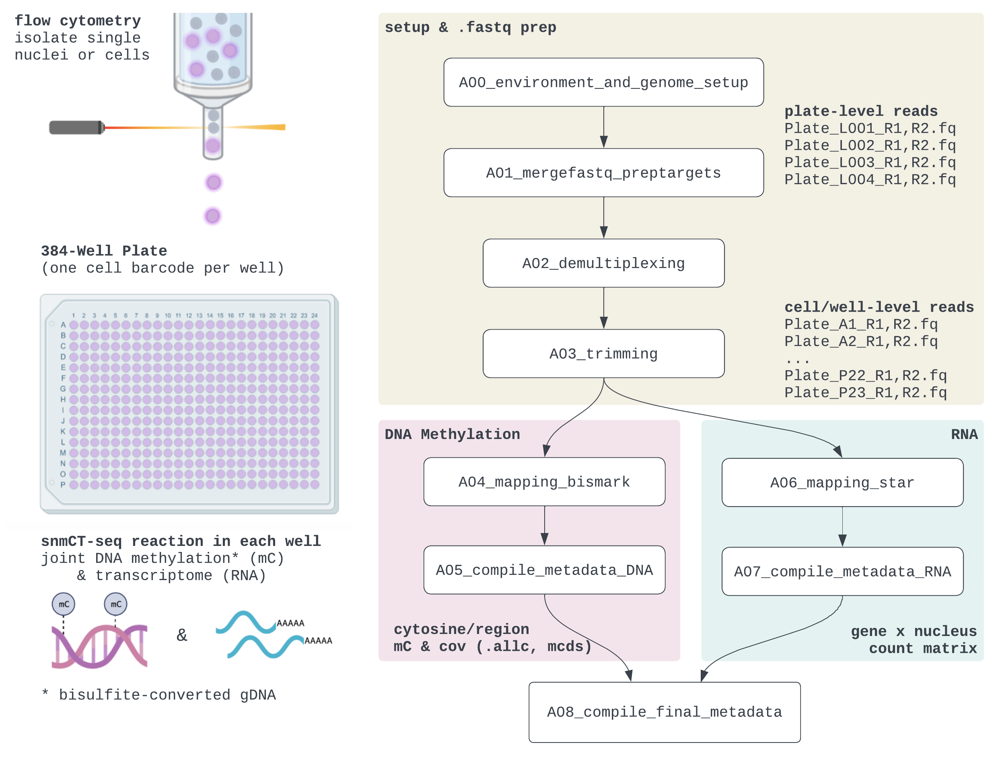

# Detailed Overview




## Library Structure


Each read contains either bisulfite-converted DNA sequence *or* fully methylated transcriptomic cDNA (these are separated _in silico_). For expected nucleotide sequences, please see our library's [seqspec](https://igvf.github.io/seqspec/specs/snmCTseq/spec.html).


## Table of Contents

- [A00_environment_and_genome_setup](#a00_environment_and_genome_setup)
- [A01_mergefastq_preptargets](#a01_mergefastq_preptargets)
- [A02_demultiplexing](#a02_demultiplexing)
- [A03_trimming](#a03_trimming)
- [A04_mapping_bismark](#a04_mapping_bismark)
- [A05_mapping_star](#a05_mapping_star)
- [A06_A08 metadata compilation](#a06-a08-metadata-compilation)
- [Final Directory Structure](#final-directory-structure)

---

<br><br><br>
# A00_environment_and_genome_setup

* Clone (`git clone`) or download this repo as a .zip file [from the releases page](https://github.com/chooliu/snmCTseq_Pipeline/releases). Rename the resulting folder to an informative "project directory" to hold scripts & outputs.

* Install the dependencies in `Documentation/snmCTseq.yml`. Conda installation highly recommended for convenience/reproducibility.
```
module load anaconda3 # or otherwise access conda
conda env create -f Documentation/snmCTseq.yml
```

* Prep the following directory structure in a new "project directory" where output files will be stored.
```
projdir=/u/project/cluo/chliu/Analyses/IGVF # informative study name
mkdir $projdir; cd $projdir
mkdir fastq_demultip fastq_raw fastq_trimmed mapping_bismark mapping_star
mkdir Metadata Notebooks Scripts sublogs
```
* ⚠🚨 Using the included Juypter `Notebooks` or a text editor, customize the project-specific parameters in `snmCT_parameters.env`, submission scripts (`Scripts/*.qsub`), and `A01b.py` + `A01c.py`, especially checking for:
    - (i) compatibility with your compute/scheduler infrastructure and sequencing depth\
    (resource suggestions assume ⪅ 3 million total reads/well average; generally 32 plates or fewer/NovaSeq S4)
    - (ii) genome/reference organism
    - (iii) **job array ranges**, which vary based on the number of 384-well plates profiled\
    \
    The array range `-t 1-Nplates` is used for tasks performed at the plate level (e.g., demultiplexing), but `-t 1-Nbatches` for more intensive tasks like alignment. By default, each "batch" contains 24 cells (one wellplate row).

* Run customized `*.qsub` submission scripts `A00a`, `A00b`, ..., `A01a`, etc., starting with reference genome prep (`.fasta` sequence and `.gtf` annotations) with the following commands.


### A00 Commands to Run ⭐

Each section has a code block showing typical `qsub` commands. These can be run all at once if `-hold_jid`/`-hold_jid_ad` or equivalent is supported by the scheduler. 

```
# check desired ref genome, paths, & snmCT_parameters.env before running
qsub Scripts/A00a_genome_dl_index.sub  
qsub Scripts/A00b_genome_prep_bismark.sub
qsub Scripts/A00c_genome_prep_star.sub
qsub Scripts/A00d_annotations_bed.sub
```

**Always submit from within the project directory.** (Or if `qsub -cwd` flag not supported, edit to use absolute filepath for `.env` file, followed by `cd $projdir`)

<br><br><br>
# A01_mergefastq_preptargets

### A01 Commands to Run ⭐

```
qsub Scripts/A01a_merge_lanes.sub # * -t 1-Nplates
qsub Scripts/A01b_plate_metadata.sub
```

* Our raw data is demultiplexed at the plate-level (i5/i7 index reads) and base-called via Basespace/`bcl2fastq`. The resulting nomenclature is effectively `Plate_L00*_R1.fq.gz` (Read 1) and `Plate_L00*_R2.fq.gz` (Read 2). The "Plate" name usually contains study-specific metadata separated by dashes that are useful to retain.
* **A01a:** We generally assume no substantial lane-effect and concatenate a given plate's files into `fastq_raw/Plate_R1.fq.gz` and `fastq_raw/Plate_R2.fq.gz`. (Make sure the Plate identifier is unique.)
* **A01b:** Extract plate-level metadata from `.fq` names.
* **A01c:** The anticipated filepath intermediate and final file outputs are predictable for each well, so we expand the plate-level metadata into well-level metadata. Each well corresponds to one nucleus/cell, and is uniquely identified by its "`wellprefix`" (Plate_Well, where Well is the 384-well plate position in {A1, A2, ..., A23, A24, B1, ..., P23, P24}).
* ⚠🚨️ **The number of wells per batch is also defined in A01c.** There is a tradeoff between the number of tasks and resources per task needed. As of April 2023, users are reporting increased difficulty requesting long jobs; a potential fix is to decrease the number of wells per step. (e.g., `h_rt=48:00:00` in bismark mapping could be bottleneck, can switch to e.g., 12 wells/batch & 24 hours.) Time and resource suggestions are given in each submission script/Notebook.

### Example of Plate & Well Files
```
20220831-IGVF-A10-D0-C02_S18_L001_R1_001.fastq.gz
20220831-IGVF-A10-D0-C02_S18_L001_R2_001.fastq.gz
...
20220831-IGVF-A10-D0-C02_S18_L004_R1_001.fastq.gz
20220831-IGVF-A10-D0-C02_S18_L004_R2_001.fastq.gz
```

In A01, these are concatenated across sequencing lanes into `20220831-IGVF-A10-D0-C02_S18_R1.fastq.gz` and `20220831-IGVF-A10-D0-C02_S18_R1.fastq.gz` (verify that this filename still distinguishes the plate from others).

Plate names are parsed into `Metadata/A01b_plate_metadata.csv` (the dash-separated line, timepoint info specific for our 16-plate IGVF pilot experiment):
```
                           plate   dateseq line  time plateindex  platenum
1   20220831-IGVF-A10-D0-C02_S18  20220831  A10    D0    C02_S18         1
2  20220831-IGVF-A10-D26N-A10_S8  20220831  A10  D26N     A10_S8         2
3  20220831-IGVF-A10-D26P-A02_S2  20220831  A10  D26P     A02_S2         3
...
```
`Metadata/A01c_well_filepaths.csv` has one row for well, where `Nplates*384` total wells are expected. Each well is uniquely identified by it's "`wellprefix`". The first wellplate row of `20220831-IGVF-A10-D0-C02_S18` constitute the first job task `batchnum` by default (`Nbatches = Ncells/24`).

```
                           wellprefix  batchnum                                A04a_bam_bismark_PE
1     20220831-IGVF-A10-D0-C02_S18_A1         1  mapping_bismark/20220831-IGVF-A10-D0-C02_S18_A...
2     20220831-IGVF-A10-D0-C02_S18_A2         1  mapping_bismark/20220831-IGVF-A10-D0-C02_S18_A...
3     20220831-IGVF-A10-D0-C02_S18_A3         1  mapping_bismark/20220831-IGVF-A10-D0-C02_S18_A...
...                               ...       ...                                                ...
6142  20220831-IGVF-C4-D3-C05_S21_P22       256  mapping_bismark/20220831-IGVF-C4-D3-C05_S21_P2...
6143  20220831-IGVF-C4-D3-C05_S21_P23       256  mapping_bismark/20220831-IGVF-C4-D3-C05_S21_P2...
6144  20220831-IGVF-C4-D3-C05_S21_P24       256  mapping_bismark/20220831-IGVF-C4-D3-C05_S21_P2...
```

### A01 Troubleshooting Notes
* Explicit filepath specification is used to make one of the most manually time-consuming challenges of not using a workflow manager--checking file outputs/partially failed jobs--slightly less painful.
    - If a batch job didn't finish for whatever reason (e.g., some wells have unusually high read depth; node crashes), code like the following can help identify the job array to re-run:
    `metadat_well <- read.tsv("Metadata/A01c_well_filepath.tsv"); metadat_well$batchnum[sapply(targets$A04a_bam_bismark_PE, file.size) > 0]` in R
    - or analogous commands like`[os.path.getsize(f) > 0 for f in list_of_filepaths]` in python, or  `[[ ! -s $filepath ]]` looping through filepath in shell (see script `A02b` for examples.)
* Where possible, steps are ideally performed in POSIX-independent command line, or if needed python (to maintain conda environment/version control). There's thus some clunky components of each script: namely, parsing the filepaths with `$basharrays{[@]}` and `query_metadat` function in most scripts (finds column name in `metadat_well` &rarr; returns target rows associated with the batchnum or platenum of interest).
* If a spike-in bisulfite conversion control is used, add to reference genome (e.g., Lambda phage sequence, see `A00a` script).
* A study could also have on-going data collection. Specifying a new A01b and A01c targets file in the `snmCTseq_parameters.env` file helps organize processing of newly assayed plates; however, it just may be tidier to just start a new project directory &rarr; merge afterwards.
* Alternatives to manually editing each `.sub` script to modify `#$ -t 1-Nplates` or `1-Nbatches`:
    - One could do a sed replace like the following: `sed -i.orig '/^#/ s/1-256/1-512/' Scripts/*.sub` (changed `A01c` to run 256 wells/batch &rarr; 512 wells/batch and now changing job arrays to reflect this; modifying every submission script in place but saving original with `.orig`).
    - If the number of plates differs or just one batch failed, setting `-t` via command line will supersede the range in the script. e.g.,  `qsub -t 2 Scripts/A01a_merge_lanes.sub` (re-runs just plate 2 even though `-t 1-Nplate` is in the script).

---

<br><br><br>
# A02_demultiplexing


### A02 Commands to Run ⭐

```
qsub Scripts/A02a_demultiplex_fastq.sub # * -t 1-Nplates
qsub Scripts/A02b_check_demultip.sub #
qsub Scripts/A02c_fastqc_demultip_fastq.sub
```

* Each Read 1 begins with a 8bp cell barcode specific to one of the 384 wells in the plate, and by extension one nucleus/cell (barring relatively rare doublets or empty wells from flow cytometry sorting; likely <3%).
* The sequences and their corresponding positions are predefined (`Scripts/A02a_cellbarcodes_subset[1,2].fa`) and repeated across plates.
* A02a: We check the 8bp barcode for each read-pair, demultiplex the plate-level `fastq_raw/Plate_R1.fastq.gz` &rarr; well-level `fastq_demultip/Plate_Well_indexed_R1.fastq.gz` and `fastq_demultip/Plate_Well_indexed_R2.fastq.gz` files, for the 384 wells in {A1, A2, ..., P23, P24}.
* A02b: Check if expected outputs present, calculate number of empty wells.
* A02c: Apply `FastQC` on random subset of wells. Due to bisulfite conversion/cell barcodes, take % CG metrics & base composition plots with a grain of salt.

### A02 Troubleshooting Notes
* Two text summaries `fastq_demultip/Plate_summary_[1,2].txt` are printed to show the number of cell barcodes detected for each plate. The number of "unassigned" barcodes should be around ~50% because the cell barcodes safelist is queryed in two subsets to decrease resource demands. We typically see 1-3% reads per plate total unassigned.
* Wells with no cell barcodes detected will have no .fastq.gz output; some (typically) small number of empty wells is OK.
* I call the 8bp a "cell barcode" to unify our assay with convention, but past snmC pipelines/papers may call it an "index" (hence the "`indexed`" in the demultiplexed filenames). 
* We currently only check of exact barcode matches; may accomodate a 1-2bp mismatch in the future.

---

<br><br><br>
# A03_trimming


### A03 Commands to Run ⭐
```
qsub Scripts/A03a_trimming_fastp.sub # † -t 1-Nbatchnum
qsub Scripts/A03b_check_trimmed.sub
qsub Scripts/A03c_fastqc_trimmed.sub
```

* Now that the sequences are demultiplexed, we remove the cell barcode, random hexamer priming sequence, artifactual adaptase tail in our expected library structure (figure above). In addition, we want to trim adapter/the random 9H primer sequences (due to mean insert sizes ~250-300, potentially present in both 5'/3' ends), low complexity sequences (polyN), and Q-score < 20 regions.
* There are scenarios where Read 1 passes QC to some minimum length, but Read 2 does not. These "trimming singletons" have to be mapped in single-end mode in subsequent steps. Four files will thus be generated in `fastq_trimmed`: R1 with a mate, R2 with a mate, R1 trimming singletons, R2 trimming singletons.
* **A03a.** Trimming via `fastp`.
* **A03b.** Checks all expected output files present.
* **A03c.** Re-runs `FastQC` for comparison to pre-trimming sequences. Should see the majority of cells pass QC, and shifts towards higher mean Q-Score, lower % adapter, and more even base compositions along position in the read.


### A03 Troubleshooting Notes:
* The "H" sequence refers to A, C, and T nucleotides.
* The contaminating sequence list is in `Scripts/A03a_adapter_sequences.fa`. Illumina adapter contamination is most common (Smart-primers rare). I included reverse compliments in case of very small insert size libraries.
* `FastQC` occasionally reports wells with high Illumina adapter sequence (often >50% adapter &rarr; still ~20-30% post-trimming) that are not removed by other trimming programs (incl. cutadapt, TrimGalore) or multiple rounds of trimming (comparable residual % adapter, but much higher resource requirements). Ancedotally, these wells often seem to have some extremely small insert sizes (low/fragmented template and majority artifacts/adapter-dimer?), as well as fewer absolute numbers of demultiplexed reads (by 10 to 100-fold). I don't currently calculate adapter % as a QC metric as these wells usually thus get excluded in downstream QC steps by virtue of read count or mapping rates.
*  ⚠🚨 **Re-submitting incomplete jobs:** Most scripts are designed so that if the output file(s) for a already exists, the well is skipped (`skip_complete=true`). As a consequence, if A03b reports any missing wells, we can simply just submit `qsub Scripts/A03a_trimming_fastp.sub` again without disrupting completed wells.
* Or, if all of the missing files are from one batch (let's say batch 123), we can run `qsub -t 123 Scripts/A03a_trimming_fastp.sub`.
* For Hoffman2/SGE users, submitting discontinuous task IDs are not supported. You might consider a for loop in this case. During these resubmissions we could increase the computational resources requested for these resubmissions if the job failure e.g., if there is insufficient memory based on the `sublogs/` text files (probably not the case for A03*, but possible for subsequent steps):
```
for batchnum in 1 3 10 50
do
     qsub -t $batchnum -l h_data=36G Scripts/A03a_trimming_fastp.sub
done
```

---

<br><br><br>
# A04_mapping_bismark

### A04 Commands to Run ⭐
```
qsub Scripts/A04a_bismark_map_to_allc.sub # †
qsub Scripts/A04b_check_bismark.sub 
qsub Scripts/A04c_allc_to_mcds.sub  # *
qsub Scripts/A04d_calc_mC_fracs.sub  # †
qsub Scripts/A04e_samstats_DNA.sub  # †
qsub Scripts/A04f_coverage_DNA.sub # †

# * = job array based on "platenum" (-t 1-Nplates)
# † = job array based on "batchnum" (-t 1-Nbatchnum, default one plate row at a time)
```

* **A04a:** Maps the trimmed .fastqs via a **"two-stage"** mapping procedure (paired-end followed by single-end), QCs alignments, then performs final quantification into an `.allc` file.
    - Proper read pairs (both R1 and R2 pass `A02` trimming) are aligned in paired-end mode (`bismark`).
    - Due to high chimeric proportions possible in low input WGBS/PBAT, unmapped reads from this first stage of mapping ("mapping singletons") are combined with the "trimming singletons" for re-mapping as single-end.
    - Remove PCR/optical duplicates (`picard MarkDuplicates`), MAPQ < 10 alignments (`samtools view -q 10`).
    - Non-CG methylation levels are used for _in silico_ filtering of DNA from RNA. By design, the RNA-derived cDNA should be fully methylated, whereas non-CG methylation levels (aka CH-methylation) tend to be low. We thus keep alignments containing ≥3 CH-context cytosines and mCH/CH levels < 0.50, inferred from Bismark's `XR` flag.
    - Finally, `allcools` converts the QC'd alignments into the tab-separated `.allc` format. See [allcools documentation](https://lhqing.github.io/ALLCools/start/input_files.html) for more details. Example file:
    ```
    chr1    3785375    +    CCG    0    2    1
    chr1    3785376    +    CGG    2    3    1
    chr1    3791778    -    CTG    0    2    1
    ```
    Interpretation: On the positive strand at chr1:3785376, there is a cytosine followed by a "GG" sequence. This CG-site has 2 reads aligning to the cytosine suggesting methylation, and three reads overlap the site in total. We don't presently use the last column (all 1s). The other two positions shown are CH-sites (C not followed by G).

* **A04b:** Checks A04a output. Makes `.tsv` lists of valid `.allc.gz` files for next step.
* **A04c:** Summarizes the cytosine-level information from `.allc` listed in the A04b `.tsv` files into methylation and coverage counts across predefined regions (e.g., 100kb bins, genebody). Stored as a "mcds" and accessed via `from ALLCools.mcds import MCDS; MCDS.open()` (step can be skipped if not using `allcools`)
* **A04d:** Global CG- and CH-methylation fractions are summarized by summing all methylation reads / all coverage. In addition, mCCC/CCC (and partially methylated Lambda "chrL", if spiked-in and added to reference genome in step `A00*`) are tabulated to estimate bisulfite non-conversion levels.
* **A04e:** Run `samtools stats`, primarily as a way to quickly count the final number of counts post-filtering.
* **A04f:** Use `samtools mpileup` to estimate coverage, including chrX versus chrY coverage ratio for sex prediction.


### A04 Troubleshooting Notes
* Expected final output: Each well will have its filtered alignments (`.bam`), quants (`.allc.gz`), and some metadata `.txt` files stored under `mapping_bismark/wellprefix/`. There's additionally batch-level metadata (`Metadata/A04d*`) and plate-level region summaries (`mcds/platenum`)
* A04a with is the most memory- and time-consuming component of the pipeline, with ~30 minutes per well.
    - Both mapping & quantification are included because they both require high mem; however, could separate if easier to request a greater number of shorter jobs (less walltimes) than a long high resource jobs.
    - See "Re-submitting incomplete jobs:" note in Section A03 above -- most scripts including A04a are designed so that if the output file(s) for a already exists, the well is skipped (`skip_complete=true`). Thus if A04b reports any missing wells, we can simply resubmit A04a again without disrupting completed wells.
* Felix Kruger discusses this paired followed by single-end mapping approach for PBAT/single-cell libraries (and other relevant issues like random primer trimming) in the [Bismark FAQ](https://github.com/FelixKrueger/Bismark/blob/master/Docs/FAQ.md).
* The major potential pitfall is memory issues during .allc generation, yielding a truncated file (e.g., could stop at chr14, or missing columns). If the `A04b` checks gives many such warnings, considering increasing time/memory requested per batch.
* The mCH/CH < 0.50 and CH ≥ 3 _in silico_ filtering criteria to define a DNA-sourced read was originally established in the snmCAT-seq paper and re-validated here by estimating misclassification error by applying the two-stage pipeline to two snmC-seq2 (methylation-only) and smart-seq2 (RNA-only) datasets.
    - 0.40% of methylation-only reads are improperly discarded, and 0.45% of RNA-only reads are improperly included (classified as DNA).
    - The new paired-end protocol also allows us to consider whether we should only keep alignments in which both Read 1 and Read 2 were assigned as DNA reads. This type of filtering changes the respective errors to 1.3% and 0.10%. Due to the possibility of DNA-RNA chimeras in the true mixed-template dataset, we elected to keep any DNA-assigned alignment, regardless of its mate's classification.
    - Recommend increasing the minimum number of CH-sites per read if increased stringency is desired. (Currently expanding number of samples & tissue types examined for this evaluation, but these criteria were for brain tissues, which have some known levels of CH-methylation.)
* During the mCH/CH filtering step in `A04a`, a tab separated file with suffix `_annotations` is generated showing mCH/CH, number of CH, and classification for each alignment to track why reads were excluded. This paired-end, two-stage mapping pipeline can be used with minor modifications for the methylation-only snmC-seq2/3 assay by skipping this filtering step and the STAR mapping (`A05`).
* MCDS Issues: In practice, I tend to create a conda environment for the bioinformatics processing (`snmCTseq.yaml`) and a separate environment for downstream analysis, including loading the MCDS data. Because the dependencies (`requirements.txt`) for `allcools` are not themselves stringently version-locked, I've recently noticed some possible issues with the MCDS not being in the expected format for allcools downstream functions.
    - Namely, "chrom100k_chrom",  "chrom100k_start", "chrom100k_end" should be read as "non-dimension coordinates" in `xarray` parlance rather than dimensions.
    - Thus when we read `mydata = MCDS.open(...)`  and examine  `mydata`, there should be four dimensions (chrom100k, count_type, mc_type, and cell) printed, instead of seven (additionally "chrom100k_chrom", "_start", "_end"). 
    - I'm currently exploring if this is driven by version mismatches between the bioinformatics environment and analysis environment but cannot clearly reproduce this issue. I think this can be circumvented by running just A05d in the analysis environment instead (replace `conda activate snmCTseq` with `conda activate myanalysisenv`. I may package a recommended base analysis .yaml file in the future. 
* Files like `mcds/5.mcds_tmp` file are present as the allc to mcds step is running. If any _tmp files are still present after A04c finishes running, I recommend resubmitting that job requesting more time or memory.

---

<br><br><br>
# A05_mapping_star

### A05 Commands to Run ⭐

```
qsub Scripts/A05a_star_mapping.sub # † 
qsub Scripts/A05b_check_star.sub 
qsub Scripts/A05c_star_filtering.sub # † 
qsub Scripts/A05d_featurecounts.sub   # *
qsub Scripts/A05e_star_bam_stats.sub # † 

# * = job array based on "platenum" (-t 1-Nplates)
# † = job array based on "batchnum" (-t 1-Nbatchnum, default one plate row at a time)
```

* **A05a:** Mapping with `STAR`, again in "two-stage" mode (paired-end mapping followed by single-end mapping of trimming and mapping singletons).
* **A05b:** Check A05a output.
* **A05c:** _In silico_ RNA filtering for mCH/CH > 0.90 via `MD:Z` flag, assuming that bisulfite converted methylated CH-cytosines will effectively look like C to T sequencing errors in CIGAR strings.
* **A05d:** Exon- and gene-level quantification via `featureCounts`. One count table for each of the three alignment schemes (paired-end, single-end R1, and single-end R2) that can be joined before analysis.
* **A05e:** `samtools stats` and `picard CollectRnaSeqMetrics`.


### A05 Troubleshooting Notes
* Expected final output: Each well will have its filtered alignments (`.bam`) and some metadata `.txt` files stored under `mapping_star/wellprefix/`, and read count quantifications under `featurecounts_gene/` and `featurecounts_exon/`. These should be gene x cell matrixes that can be summed (matrix addition of PE + SE1 + SE2).
* In previous pipeline iterations, `A01` would throw errors about improper loading into memory, or the job never proceeding past genome loading. This seems to be an artifact of jobs running concurrently on the same node. To combat this effect, we request an exclusive node; depending on queue/cluster load, may be more efficient to request a longer job based on `platenum` versus `batchnum`.
* This mCH/CH > 0.90 filtering criteria was re-verified on snmC-seq2 (methylome-only) and Smart-seq2 (RNA-only). 0.14% of DNA-only sequences were incorrectly classified as RNA. ~0.50% RNA-only sequences were incorrectly discarded.
    - The bisulfite-converted DNA-only sequences generally just do not align (~1.5% mapping rate). 
    - If imposing the criteria that both read-pairs have to be assigned as RNA, ~0.91% RNA-only sequences were incorrectly excluded. Then 0.34% DNA-only sequences were incorrectly classified as RNA, and of these, less than half overlap gene features in `featureCounts`.
* On a related note, the mapping rate in STAR tends to look poor (<10%), but this usually reflects the relatively higher amount of DNA template (and thus gDNA library) available in a given cell. This motivates the "adjusted RNA mapping rate" in the next section.

---

<br><br><br>
# A06-A08 metadata compilation

### Metadata Commands to Run ⭐

```
qsub Scripts/A06_compile_DNA_metadata.sub
qsub Scripts/A07_compile_RNA_metadata.sub
qsub Scripts/A08_compile_final_metadata.sub
```

* These helper scripts just collect the metadata already generated in previous steps into well-level metadata tables for QC (stored in the `Metadata/` folder). Each row is equal to one `wellprefix`.
* Also does some basic calculations possible after compilation:
    - combine paired-end and single-end metrics (e.g., overall bismark mapping rate, total mapped reads).
    - dual-modality metrics like adjusted RNA mapping rate = (RNA counts) / (total counts - DNA counts), estimated percent of reads DNA over total reads
* Run DNA and RNA submissions after their respective modalities finish in ( `A04*`,  `A05*`), and `A08` after all previous steps finish. 
* The next step is generally to perform QC at the cell-level, selecting which to proceed with for downstream analyses.
    
### Methylome

With the caveat that nucleus exclusion criteria can be very context- and study-specific, here are some criteria that the Luo Lab/Salk Institute has used in past work:

* "combined" (paired- & single-end) DNA mapping rate > 0.50
* final read count > 500,000
* mCG/CG > 0.50
* mCH/CH < 0.10 \*
* mCCC/CCC < 0.01 or spike-in mLambda < 0.01 (i.e., bisulfite conversion ⪆ 99%) \*
* \* some cell-types like neurons are known to harbor relataively high non-CG methylation; e.g., in tissue containing neurons, we use instead mCH/CH < 0.20 and mCCC/CCC < 0.03
* extremely high DNA coverage (>10%?)

### Transcriptome

While DNA levels and quality tends to be stable from cell-to-cell, I've found that RNA recommendations are more difficult to define *a priori*: they may be more sensitive to cell-type (e.g., global transcription levels, number genes detected) and technical effects (e.g., less RNA template than DNA in cell &rarr; lower RNA counts &rarr; potentially more sensitive to ambient contamination or noise).

At present, I thus look for outliers with respect to the following, versus imposing hard cut-offs:

* number genes detected
* total mapped counts
* detected number of genes/total counts (some measure of library complexity)
* adjusted RNA mapping rate
* intronic fraction
* intergenic fraction
* fraction of total reads from RNA, versus DNA


---

<br><br><br>
# Final Directory Structure

After everything's run, here's what the expected project structure looks like, using the 16-plate IGVF project as an example. Some optional files are shown, but the final essential outputs of interest are indicated with `# <-- ⭐`.

```
.
├── snmCT_parameters.env
├── fastq_demultip/
│   ├── 20220831-IGVF-A10-D0-C02_S18_A1_indexed_R1.fastq.gz
│   ├── 20220831-IGVF-A10-D0-C02_S18_A1_indexed_R2.fastq.gz
│   ├── ...
│   ├── 20220831-IGVF-A10-D0-C02_S18_P24_indexed_R1.fastq.gz
│   ├── 20220831-IGVF-A10-D0-C02_S18_P24_indexed_R2.fastq.gz
│   ├── 20220831-IGVF-A10-D0-C02_S18_summary_1.txt
│   ├── 20220831-IGVF-A10-D0-C02_S18_summary_2.txt
│   └── ...
├── fastq_raw/
│   ├── 20220831-IGVF-A10-D0-C02_S18_R1.fastq.gz
│   ├── 20220831-IGVF-A10-D0-C02_S18_R2.fastq.gz
│   └── ...
├── fastq_trimmed/
│   ├── 20220831-IGVF-A10-D0-C02_S18_A10.html
│   ├── 20220831-IGVF-A10-D0-C02_S18_A10.json
│   ├── 20220831-IGVF-A10-D0-C02_S18_A10_paired_R1.fastq.gz
│   ├── 20220831-IGVF-A10-D0-C02_S18_A10_paired_R2.fastq.gz
│   ├── 20220831-IGVF-A10-D0-C02_S18_A10_singletrim_R1.fastq.gz
│   ├── 20220831-IGVF-A10-D0-C02_S18_A10_singletrim_R2.fastq.gz
│   └── ...
├── featurecounts_exon/
│   ├── PE_1
│   ├── PE_1.summary
│   ├── SE1_1
│   ├── SE1_1.summary
│   ├── SE2_1
│   ├── SE2_1.summary
│   ├── ...
│   ├── SE2_16
│   └── SE2_16.summary
├── featurecounts_gene/
│   ├── PE_1
│   ├── PE_1.summary
│   ├── SE1_1
│   ├── SE1_1.summary
│   ├── SE2_1
│   ├── SE2_1.summary
│   ├── ...
│   ├── SE2_16
│   └── SE2_16.summary
├── mapping_bismark/
│   ├── 20220831-IGVF-A10-D0-C02_S18_A1/
│   │   ├── 2022081-IGVF-A10-D0-C02_S18_A1_paired_R1_bismark_bt2_pe.bam
│   │   ├── 2022081-IGVF-A10-D0-C02_S18_A1_paired_R1_bismark_bt2_PE_report.txt
│   │   ├── 2022081-IGVF-A10-D0-C02_S18_A1_paired_R1.fastq.gz_unmapped_reads_1_bismark_bt2.bam
│   │   ├── 2022081-IGVF-A10-D0-C02_S18_A1_paired_R1.fastq.gz_unmapped_reads_1_bismark_bt2_SE_report.txt
│   │   ├── 2022081-IGVF-A10-D0-C02_S18_A1_paired_R1.fastq.gz_unmapped_reads_1.fq.gz
│   │   ├── 2022081-IGVF-A10-D0-C02_S18_A1_paired_R2.fastq.gz_unmapped_reads_2_bismark_bt2.bam
│   │   ├── 2022081-IGVF-A10-D0-C02_S18_A1_paired_R2.fastq.gz_unmapped_reads_2_bismark_bt2_SE_report.txt
│   │   ├── 2022081-IGVF-A10-D0-C02_S18_A1_paired_R2.fastq.gz_unmapped_reads_2.fq.gz
│   │   ├── 2022081-IGVF-A10-D0-C02_S18_A1_singletrim_R1_bismark_bt2.bam
│   │   ├── 2022081-IGVF-A10-D0-C02_S18_A1_singletrim_R1_bismark_bt2_SE_report.txt
│   │   ├── 2022081-IGVF-A10-D0-C02_S18_A1_singletrim_R2_bismark_bt2.bam
│   │   ├── 2022081-IGVF-A10-D0-C02_S18_A1_singletrim_R2_bismark_bt2_SE_report.txt
│   │   ├── allc_check.txt
│   │   ├── allc.tsv.gz # <-- ⭐
│   │   ├── allc.tsv.gz.tbi 
│   │   ├── nbases_cov_by_chr
│   │   ├── PE_dedupeq10.sam_annotations
│   │   ├── PE_final.bam # <-- ⭐
│   │   ├── PE_final.bam.bai
│   │   ├── picard_PE.log
│   │   ├── picard_SE.log
│   │   ├── samstats_PE
│   │   ├── samstats_SE
│   │   ├── SE_dedupeq10.sam_annotations
│   │   ├── SE_final.bam # <-- ⭐
│   │   ├── SE_final.bam.bai
│   │   └── total_cov_by_chr
│   ├── 20220831-IGVF-A10-D0-C02_S18_A2/
│   ├── ...
│   ├── 20220831-IGVF-A10-D0-C02_S18_P23/
│   └── 20220831-IGVF-A10-D0-C02_S18_P24/
├── mapping_star/
│   ├── 20220831-IGVF-A10-D0-C02_S18_A1/
│   │   ├── PE.Aligned.out.bam
│   │   ├── PE.Final.bam # <-- ⭐
│   │   ├── PE.Final.bam.bai
│   │   ├── PE.Log.final.out
│   │   ├── PE.SJ.out.tab
│   │   ├── PE.Unmapped.out.mate1.gz
│   │   ├── PE.Unmapped.out.mate2.gz
│   │   ├── picard_PE
│   │   ├── picard_SE1
│   │   ├── picard_SE2
│   │   ├── q10_pe.sam_annotations
│   │   ├── q10_se1.sam_annotations
│   │   ├── q10_se2.sam_annotations
│   │   ├── samstats_PE
│   │   ├── samstats_SE1
│   │   ├── samstats_SE2
│   │   ├── SE1.Aligned.out.bam
│   │   ├── SE1.Final.bam # <-- ⭐
│   │   ├── SE1.Final.bam.bai
│   │   ├── SE1.Log.final.out
│   │   ├── SE1.SJ.out.tab
│   │   ├── SE2.Aligned.out.bam
│   │   ├── SE2.Final.bam # <-- ⭐
│   │   ├── SE2.Final.bam.bai
│   │   ├── SE2.Log.final.out
│   │   └── SE2.SJ.out.tab
│   ├── 20220831-IGVF-A10-D0-C02_S18_A2/
│   ├── ...
│   ├── 20220831-IGVF-A10-D0-C02_S18_P23/
│   └── 20220831-IGVF-A10-D0-C02_S18_P24/
├── mcds/
│   ├── 1.mcds/
│   ├── 2.mcds/
│   ├── ...
│   └── 16.mcds/
├── Metadata/
│   ├── A01b_plate_metadata.csv # <-- ⭐ 
│   ├── A01c_well_filepath.csv # <-- ⭐
│   ├── A04d_mCfrac_1.csv
│   ├── A04d_mCfrac_2.csv
│   ├── ...
│   ├── A04d_mCfrac_256.csv
│   ├── A06a_trimming.tsv
│   ├── A06b_DNA_maprate_PE.tsv
│   ├── A06b_DNA_maprate_SE1trim.tsv
│   ├── A06b_DNA_maprate_SE1unmap.tsv
│   ├── A06b_DNA_maprate_SE2trim.tsv
│   ├── A06b_DNA_maprate_SE2unmap.tsv
│   ├── A06c_DNA_picard_PE.tsv
│   ├── A06c_DNA_picard_SE.tsv
│   ├── A06d_DNA_compiled_mCfracs.tsv
│   ├── A06e_DNA_samstats_PE.tsv
│   ├── A06e_DNA_samstats_SE.tsv
│   ├── A06f_DNA_cov_chrXdivY.tsv
│   ├── A06f_DNA_cov_percent1x.tsv
│   ├── A07b_RNA_maprate_PE.tsv
│   ├── A07b_RNA_maprate_SE1.tsv
│   ├── A07b_RNA_maprate_SE2.tsv
│   ├── A07c_RNA_featcounts_exon.tsv
│   ├── A07c_RNA_featcounts_gene.tsv
│   ├── A07d_RNA_samstats_PE.tsv
│   ├── A07d_RNA_samstats_SE1.tsv
│   ├── A07d_RNA_samstats_SE2.tsv
│   ├── A07e_RNA_picard_PE.tsv
│   ├── A07e_RNA_picard_SE1.tsv
│   ├── A07e_RNA_picard_SE2.tsv
│   ├── A08a_metadata_DNA.tsv
│   ├── A08a_metadata_mC.tsv # <-- ⭐
│   ├── A08b_metadata_RNA.tsv # <-- ⭐
│   └── A08c_metadata_RNADNA.tsv # <-- ⭐
├── Notebooks/
│   ├── A00_environment_and_genome_setup.ipynb
│   ├── A01_mergefastq_preptargets.ipynb
│   ├── A02_demultiplexing.ipynb
│   ├── A03_trimming.ipynb
│   ├── A04_mapping_bismark.ipynb
│   ├── A05_mapping_star.ipynb
│   ├── A06_compile_metadata_DNA.ipynb
│   ├── A07_compile_metadata_RNA.ipynb
│   └── A08_compile_final_metadata.ipynb
├── qc_demultip/
├── qc_trimmed/
├── Scripts/
│   ├── A00a_genome_dl_index.sub
│   ├── A00b_genome_prep_bismark.sub
│   ├── A00c_genome_prep_star.sub
│   ├── A00d_gtf_annotations_bed.py
│   ├── A00d_gtf_annotations_bed.sub
│   ├── A01a_merge_lanes.sub
│   ├── A01b_plate_metadata.py
│   ├── A01b_plate_metadata.sub
│   ├── A01c_well_filepaths.py
│   ├── A02a_cellbarcodes_subset1.fa
│   ├── A02a_cellbarcodes_subset2.fa
│   ├── A02a_demultiplex_fastq.pl
│   ├── A02a_demultiplex_fastq.sub
│   ├── A02b_check_demultip.sub
│   ├── A02c_fastqc_demultip_fastq.sub
│   ├── A03a_adapter_sequences.fa
│   ├── A03a_trimming_fastp.sub
│   ├── A03b_check_trimmed.sub
│   ├── A03c_fastqc_trimmed.sub
│   ├── A04a_bismark_map_to_allc.sub
│   ├── A04a_classify_mCT_reads_bismark.pl
│   ├── A04b_check_bismark.sub
│   ├── A04c_allc_to_mcds.sub
│   ├── A04d_calc_mC_fracs.sub
│   ├── A04e_samstats_DNA.sub
│   ├── A04f_coverage_DNA.sub
│   ├── A05a_star_mapping.sub
│   ├── A05b_check_star.sub
│   ├── A05c_classify_mCT_reads_STAR.pl
│   ├── A05c_star_filtering.sub
│   ├── A05d_featurecounts.sub
│   ├── A05e_star_bam_stats.sub
│   ├── A06a_trimming.py
│   ├── A06b_DNA_maprate.py
│   ├── A06c_DNA_dedupe.py
│   ├── A06_compile_DNA_metadata.sub
│   ├── A06d_DNA_mCfracs.py
│   ├── A06e_DNA_samtools.py
│   ├── A06f_DNA_cov.py
│   ├── A07a_trimming.py
│   ├── A07b_RNA_maprate.py
│   ├── A07_compile_RNA_metadata.sub
│   ├── A07c_RNA_featcounts.py
│   ├── A07d_RNA_samtools.py
│   ├── A07e_RNA_picard.py
│   ├── A08a_final_metadat_DNA.py
│   ├── A08b_final_metadat_RNA.py
│   ├── A08c_metadata_RNADNA.py
│   └── A08_compile_final_metadata.sub
└── sublogs/
    ├── A00a_genome_dl_index.5692329
    ├── A00b_genome_prep_bismark.5692330
    ├── A00c_genome_prep_star.5692360
    ├── ...
    ├── A07_compile_RNA.5976933.5
    └── A08_compile_final.5976936
```
