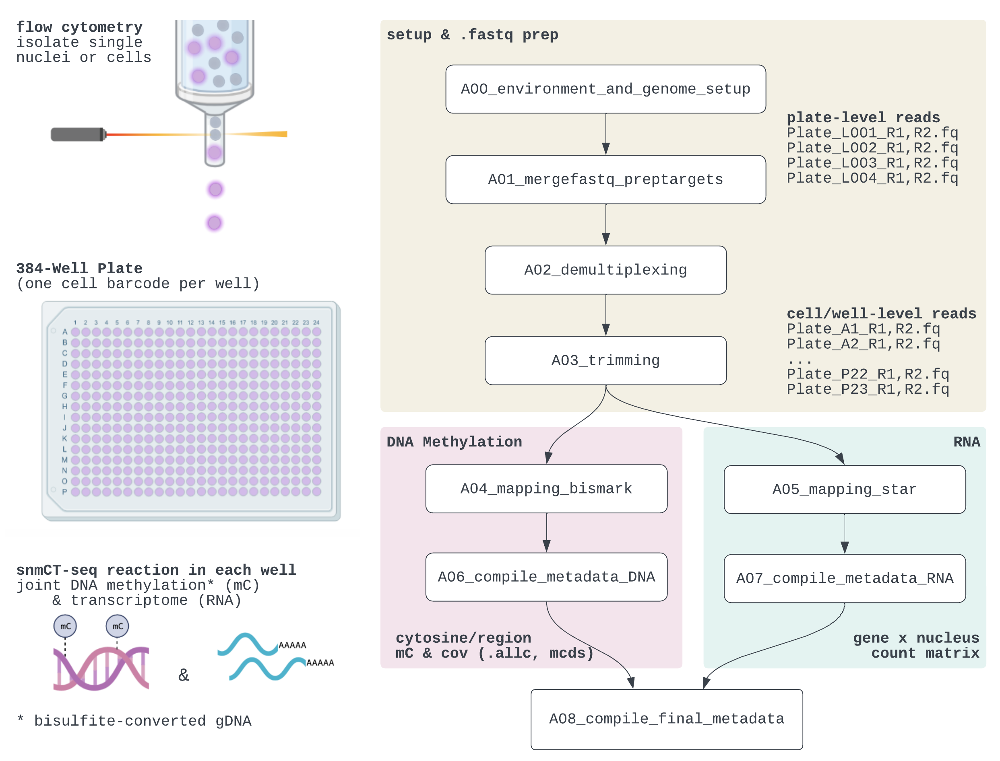

# snmCT-seq Bioinformatics Pipeline




**snmCT-seq** is a technique to simultaneously profile the DNA methylome (mC) and transcriptome from a single nucleus. Individual nuclei (or cells) are sorted into 384-well plates where the snmCT-seq reaction adds cell barcodes and generates Illumina-compatible multi-modal libraries without any physical DNA/RNA separation.

**What's this repo?**

* Scripts to go from plate-level .fastqs &rarr; cell-level alignments (.bam), quality control metrics, and analyzeable mC & RNA features.
* For the **methylome**, the primary features are the methylation counts and coverage for each cytosine in the genome (**.allc** file), which can then be aggregated across different genomic intervals (e.g., 100kb-bins, genes; **.mcds** file).
* For the **transcriptome**, the features are gene- and exon-based read counts (full-length transcript coverage, versus 3'/5'-UMI).

**What isn't this repo?**

* Cell-level QC steps, which can be celltype- and study-specific. (Some suggestions on the [Detailed Overview](./Documentation/detailed_overview.md) page and within [past manuscripts](#technology-references).)
* Downstream analysis of mC and RNA (e.g., feature selection, clustering, hypothesis testing). [allcools](https://lhqing.github.io/ALLCools/) and [seurat](https://satijalab.org/seurat/)/[scanpy](https://scanpy.readthedocs.io/) are good starting places for exporatory data analysis.

## Getting Started

1. Clone this repo (`git clone https://github.com/chooliu/snmCTseq_Pipeline.git`) or download via the [Releases page](https://github.com/chooliu/snmCTseq_Pipeline/releases). Rename folder to an informative "project directory" name.

2. Install dependencies listed in `Documentation/snmCTseq.yml`. Installation and environment management via conda highly recommended.
```
module load anaconda3 # or otherwise activate conda
conda env create -f Documentation/snmCTseq.yml
```

3. Customize `snmCT_parameters.env` and scheduler submission scripts (`Scripts/*.sub`, especially `A00*` and `A01*`) via a text editor of your choice\*, paying special note to:\
(i) compatibility with your compute/scheduler infrastrcture and sequencing depth,\
(ii) genome/reference organism,\
(iii) job array ranges based on the number of 384-well plates profiled. The range is `-t 1-Nplates` when a job is submitted for each plate (e.g., plate &rarr; well demultiplexing), but `-t 1-Nbatches` for more intensive tasks submitting small sets of wells per job (e.g., alignment; 24 wells per batch by default, so `Nbatch = Ncellstotal/24`).\
\
\* Alternatively, if you can access your server via Juypter, run each `.ipynb` in the `Notebooks` folder sequentially for organized script editing & access to extra in-line comments (also viewable in this repo's [Notebooks folder on Github](./Notebooks)).

4. Submit each submission scripts (`.sub` extension) in order:  `A00a`, `A00b`, `A00c`, `A01a`, `A01b`, ... I usually `qsub` all `A00*` scripts at once, all `A01*` at once, etc. For convenience, the full list of submission commands is listed at [Documentation/submission_helper.txt](./Documentation/submission_helper.txt)


## Links

### Repo Resources

*  [Detailed Overview](./Documentation/detailed_overview.md) (rationale for steps, FAQs, common pitfalls)
* [Notebooks](./Notebooks)
* [Revision History](./Documentation/revision_history.md)
* [list of qsub commands](./Documentation/submission_helper.txt)

### Related Pipelines

This pipeline originated from my experimental updates for processing snmCT-seq  (and closely related methylation-only snmC-seq3) data using **paired-end alignment and quantification**. Its current construction is thus a set of scripts tailored to the UCLA Hoffman2 computing server for accessibility.

Related work to consider:

* [YAP (Yet Another Pipeline)](https://hq-1.gitbook.io/mc/): supports snmCT-seq and additional related assays (e.g., mC, m3C, mCAT-seq). Snakemake. Developed by the Ecker Lab/Dr. Hanqing Liu (Salk Institute).
* [allcools](https://lhqing.github.io/ALLCools): Also by Hanqing Liu and typically used by our group for mC downstream analysis. Helpful to review for .allc and .mcds descriptions. 
* [WARP/CEMBA](https://broadinstitute.github.io/warp/docs/Pipelines/CEMBA_MethylC_Seq_Pipeline/README): Broad Institute, WDL-based snmC-seq (methylation-only) pipeline compiled as part of the BRAIN Initiative.

### Technology References

* Our library structure is described in the [Detailed Overview](./Documentation/detailed_overview.md) and a [seqspec](https://igvf.github.io/seqspec/specs/snmCTseq/spec.html). 
* Flagship assay paper (where "mCAT" = mCT plus additional NOME-seq for chromatin accessibility profiling, but also is our prefered citation for snmCT-seq)
    - [snmCAT-seq](https://pubmed.ncbi.nlm.nih.gov/35419551/): Luo, C. et al. Single nucleus multi-omics identifies human cortical cell regulatory genome diversity. Cell Genomics 2, 100107 (2022).
* Understanding the underlying mC and RNA reactions:
    - [snmC-seq2](https://pubmed.ncbi.nlm.nih.gov/30237449/): Luo, C. et al. Robust single-cell DNA methylome profiling with snmC-seq2. Nat. Commun. 9, 7–12 (2018).
    - [Smart-seq2](https://pubmed.ncbi.nlm.nih.gov/24385147/): Picelli, S. et al. Full-length RNA-seq from single cells using Smart-seq2. Nat. Protoc. 9, 171–181 (2014).  [Note: we are now on [snmC-seq3](https://www.protocols.io/view/snm3c-seq3-cwxuxfnw.html) but only a wet lab protocol citation exists.]

### Acknowledgements

* Dr. Chongyuan Luo (original workflow, demultiplexing/filtering scripts)
* Dr. Hanqing Liu ([@lhqing](https://github.com/lhqing)) for updating allcools for paired-end processing
* Luo Lab collaborators/members for pipeline testing and feedback, namely Dr. Katie Eyring (Geschwind Lab), Nasser Elhajjaoui, Kevin Abuhanna, and Terence Li.
